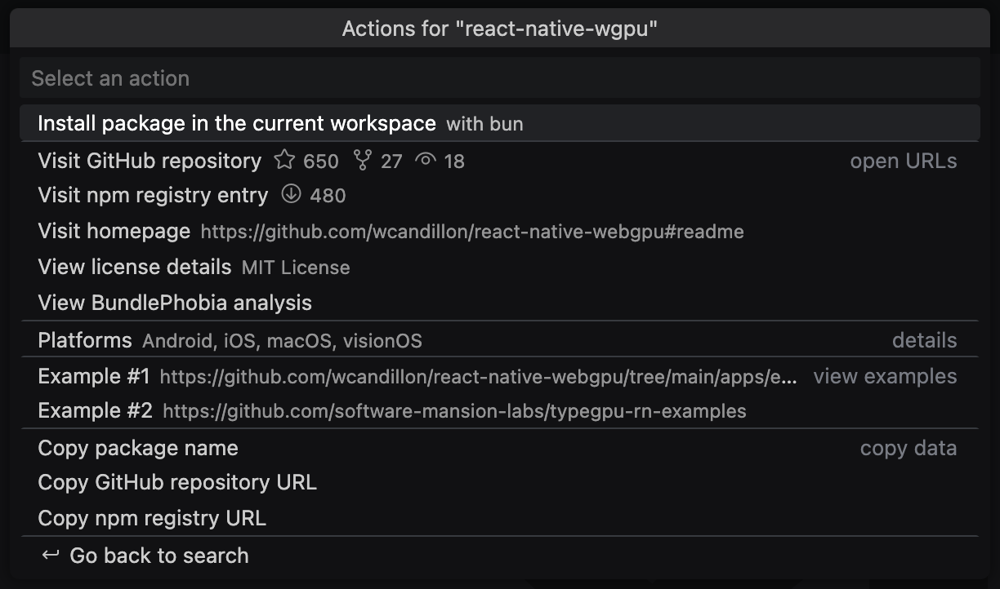

<dd align="center"></dd>
<h1 align="center">vscode-react-native-directory</h1>

<p align="center">
A VS Code extension allowing to browse through <a href="https://reactnative.directory/">React Native Directory</a><br/>
and perform actions related to the chosen package inside build-in editor Command Palette.
</p>

<p align="center">


</p>

## ⚡️ Features

* Search through the packages registered in the React Native Directory.
* Narrow down the results by using filter tokens, such as `:ios`, `:newArchitecture`, or `:hasTypes`.
  * Valid tokens are a subset of all possible API query options, and the values can be seen [in this file](/src/utils.ts#L30-L51).
* Install the selected packages in the current workspace using your preferred package manager.
* Dive deep into the stats and analysis with the provided metadata and links.

## 📦 Installation

> [!tip]
> The extension is currently in the development phase, only manual build and installation is supported at this time.

1. Make sure you have [Bun](https://bun.sh/docs/installation) installed.
1. Checkout the repository locally.
1. Run the following commands to install dependencies, compile source and prepare extension package file:
   
   ```sh
   bun install && bun compile && bun package
   ```
1. In VS Code:
   * Navigate to the **"Extensions"** pane (<kbd>Ctrl/Cmd+Shift+X</kbd>).
   * Click **"More"** button (three dots in the right corner of header) and select **"Install from VSIX"**.
   * Select VSIX file which has been created in third step inside the checkout root directory.

## 📝 Contributing

1. Make sure you have [Bun](https://bun.sh/docs/installation) installed.
1. Checkout the repository locally.
1. Run the following commands to install dependencies and compile source:
   
   ```sh
   bun install
   ```
1. In VS Code:
   * Open folder containing the extension repository.
   * Navigate to the **"Run and Debug"** pane (<kbd>Ctrl/Cmd+Shift+D</kbd>).
   * Select **"Run with extension"** launch task, and press **"Start Debugging"** button (<kbd>F5</kbd>).
